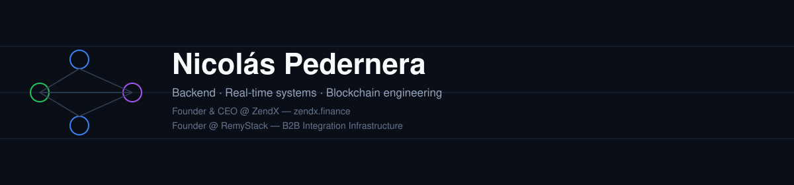
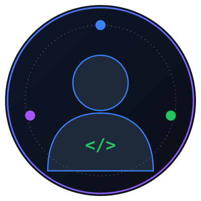

  

  

  
  
  

<table>
<tr>
<td width="220" align="center">
  
</td>
<td>

# Nicolás Pedernera

Backend / Automation / AI / Blockchain Engineering

Systems Engineer (Universidad de Buenos Aires, 2024). Founder & CEO of [ZendX](https://zendx.finance) — a fintech platform combining P2P lending, trading/exchange, prediction markets, a card product, and a custom Layer 1 blockchain.

I work across the full stack of a real fintech product: backend APIs, real-time data infrastructure, PostgreSQL persistence, and Solidity smart contracts running on our own EVM-compatible chain.

</td>
</tr>
</table>

## What I work on

- **Backend & APIs** — Node.js, TypeScript, Fastify, PostgreSQL
- **Real-time systems** — WebSocket architectures with reconnection handling, rate limiting, and multi-client broadcast
- **Blockchain & Solidity** — smart contract design with a security-first mindset (Checks-Effects-Interactions, reentrancy guards, access control)
- **AI-assisted engineering** — using AI coding tools daily, always with deliberate review rather than blind acceptance

## Tech stack

  

## Featured projects

| Proyecto | Descripción |
|---|---|
| [**order-matching-engine**](https://github.com/Nicolas-Pedernera/order-matching-engine) | Order book de límite con matching por prioridad precio-tiempo, construido desde cero — órdenes market/limit, fills parciales, recorrido del book multi-nivel y cancelación, con 24 tests cubriendo los edge cases que rompen implementaciones ingenuas. |
| [**realtime-sync-engine**](https://github.com/Nicolas-Pedernera/realtime-sync-engine) | Capa de sincronización de datos en tiempo real: reconexión con backoff exponencial, broadcast throttled por clave, y fan-out multi-cliente. Incluye un dashboard en vivo conectado a un feed de precios real de un exchange. |
| [**defi-vault-contracts**](https://github.com/Nicolas-Pedernera/defi-vault-contracts) | Vault de staking en Solidity construida para demostrar patrones de seguridad reales — orden CEI, un reentrancy guard, y una suite de tests que efectivamente ataca el contrato para probar que el guard funciona. |
| [**realtime-dashboard**](https://github.com/Nicolas-Pedernera/realtime-dashboard) | Frontend en Next.js que consume el backend de tiempo real de arriba, con su propia lógica de reconexión independiente del lado del cliente. |
| [**ai-workflow-backend**](https://github.com/Nicolas-Pedernera/ai-workflow-backend) | Backend orientado a producción para orquestación de workflows de IA — persistencia en PostgreSQL, migraciones versionadas, y registro on-chain de workflows vía un contrato Solidity. |
| [**zendx-chain**](https://github.com/Nicolas-Pedernera/zendx-chain) | Devnet de ZendX Chain — una cadena PoW abierta con modelo UTXO. Código de consenso, P2P y wallet, espejado públicamente para operadores de nodo externos. |

## GitHub stats

  
  

  

  

## Contact

- Website: [zendx.finance](https://zendx.finance)
- Portfolio: [nicolas-pedernera.vercel.app](https://nicolas-pedernera.vercel.app)
- LinkedIn: [nicolas-pedernera-zendx](https://www.linkedin.com/in/nicolas-pedernera-zendx/)
- LinkedIn (ZendX): [company/zend-x](https://www.linkedin.com/company/zend-x/)
